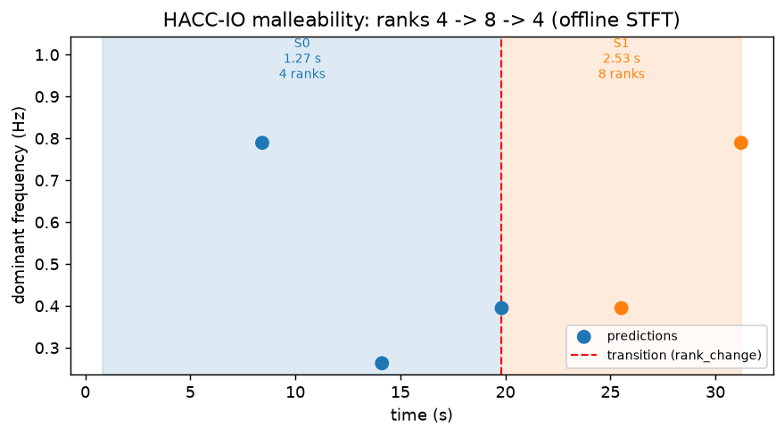

# Phase Automaton

The phase automaton models I/O behaviour as a finite state machine where each **state** represents a stable frequency regime and **transitions** are fired when the regime changes.  It is designed for online prediction scenarios where the application's I/O pattern may shift — for example, between compute phases, I/O phases, or checkpointing bursts.

- [Concept](#concept)
- [Enabling the automaton](#enabling-the-automaton)
- [Transition triggers](#transition-triggers)
  - [Rank-count trigger](#rank-count-trigger)
  - [Period-ratio trigger](#period-ratio-trigger)
  - [Statistical detector](#statistical-detector)
- [Combining triggers](#combining-triggers)
- [Export](#export)
- [Offline STFT](#offline-stft)
  - [Worked example: a real malleable run (HACC-IO, ranks 4 → 8 → 4)](#worked-example-a-real-malleable-run-hacc-io-ranks-4--8--4)
- [Examples](#examples)
- [Example output](#example-output)
- [Output JSON format](#output-json-format)
- [Reference Library](#reference-library)
  - [Application identity](#application-identity)
  - [First run — cold start](#first-run--cold-start)
  - [Subsequent runs — warm start](#subsequent-runs--warm-start)
  - [Malleable applications](#malleable-applications)
  - [Matching strategies](#matching-strategies)
  - [Library file format](#library-file-format)
  - [Configuration table (nodes)](#configuration-table-nodes)
    - [Path view vs. node view](#path-view-vs-node-view)
    - [Multiple behaviors per configuration](#multiple-behaviors-per-configuration)
    - [Two axes: wall-clock time vs. cycle count](#two-axes-wall-clock-time-vs-cycle-count)
    - [Seeding an early estimate](#seeding-an-early-estimate)
    - [Cross-path sharing](#cross-path-sharing)
  - [Redis-backed library](#redis-backed-library)
  - [Combining with other flags](#combining-with-other-flags)

---

## Concept

Each time `predictor` produces a new prediction, the automaton checks whether the new prediction belongs to the current state or signals a phase transition:

```
prediction_n  ──►  automaton  ──► same state  (no action)
                      │
                      └──► transition  ──► new state  (window reset / output)
```

States accumulate a history of predictions.  When a transition fires, a new state is opened and the analysis window can be reset to focus on the new regime.

---

## Enabling the automaton

```bash
predictor live.jsonl -f 100 --phase-automaton
```

The automaton also works offline with `ftio --transformation stft` — see [Offline STFT](#offline-stft) below.

---

## Transition triggers

Three independent triggers can fire a transition.  They can be used individually or combined (any one trigger firing is sufficient).

### Rank-count trigger

**Default: enabled.**  Fires when the number of active I/O ranks in the new prediction differs from the current state's rank count.

The rank count itself comes from one of two places:

- **Authoritative, when available** — TMIO's msgpack trace format reports `total_number_of_ranks` directly (the size of the run's own communicator) on every sample. When present, FTIO uses it verbatim, and the trigger fires the moment it changes — there is nothing to guess.
- **Inferred, otherwise** — older traces, or formats without that field, only give `number_of_ranks`, a grouping key that reflects however many ranks' messages had been received into the current window. A single window where a straggler rank hadn't reported yet can look exactly like a rank change even though nothing changed. To guard against that, an inferred rank difference must repeat for `--pa-rank-confirm` consecutive predictions (default: **2**) before it is accepted:

    ```bash
    predictor live.jsonl -f 100 --phase-automaton --pa-rank-confirm 3
    ```

    Set it to `1` to fire immediately on the first differing window (the old behaviour). There is one exception even before confirmation: if the period-ratio or statistical detector *also* fires on that same first differing window, that is strong corroborating evidence the rank change is real (a stray straggler wouldn't also move the frequency estimate), so the transition fires immediately and is still labelled `rank_change` rather than `frequency`.

Disable the trigger entirely with `--pa-no-rank-trigger`:
```bash
predictor live.jsonl -f 100 --phase-automaton --pa-no-rank-trigger
```

### Period-ratio trigger

**Default: disabled.**  Fires when the ratio between the new and current dominant period exceeds a threshold:

```
max(T_new / T_cur,  T_cur / T_new)  >  RATIO
```

`RATIO = 1.5` means a 50 % change in period length triggers a transition.

```bash
predictor live.jsonl -f 100 --phase-automaton --pa-period-ratio 1.5
```

No warm-up period is needed; the check activates from the second prediction onwards.

### Statistical detector

**Default: `ksigma`.**  A statistical change-point test applied to the series of dominant-frequency values.  Choose with `--pa-method`:

| Method | Description | Characteristics |
|--------|-------------|-----------------|
| `ksigma` | State-adaptive k-sigma | Recommended.  Adapts threshold to within-state variance; robust to noise. |
| `cusum` | Adaptive-variance CUSUM | Fast reaction to sustained shifts; sensitive to variance changes. |
| `ph` | Page-Hinkley | Sequential test for monotonic drift; good for gradual changes. |
| `adwin` | Adaptive Windowing | Needs many samples or large frequency ratios to fire. |
| `none` | Disabled | Use only rank and/or period-ratio triggers. |

```bash
# Default: ksigma
predictor live.jsonl -f 100 --phase-automaton

# CUSUM
predictor live.jsonl -f 100 --phase-automaton --pa-method cusum

# No statistical detection, period-ratio only
predictor live.jsonl -f 100 --phase-automaton --pa-method none --pa-period-ratio 1.5
```

---

## Combining triggers

Any combination is valid.  A transition fires when **any** enabled trigger activates:

```bash
# All three triggers active
predictor live.jsonl -f 100 --phase-automaton \
    --pa-method ksigma \
    --pa-period-ratio 1.5
    # rank trigger is on by default

# Period-ratio and statistical only (no rank trigger)
predictor live.jsonl -f 100 --phase-automaton \
    --pa-method cusum \
    --pa-period-ratio 2.0 \
    --pa-no-rank-trigger
```

---

## Export

When `predictor` exits, the full automaton state (all states, transitions, and configuration) is written as JSON:

```bash
predictor live.jsonl -f 100 --phase-automaton --pa-export /tmp/my_automaton.json
```

Default path: `./phase_automaton.json`.

---

## Offline STFT

The automaton is not limited to the online predictor. `--transformation stft` already slides a window across the *entire* trace in a single call and reports a dominant frequency per window (see `ftio_stft` in `ftio/freq/_stft_workflow.py`) — that per-window sequence is exactly what the automaton needs, so one offline run reconstructs the same state/transition history the online predictor would have produced by polling ZMQ the whole time:

```bash
ftio trace.jsonl --transformation stft --phase-automaton
```

All the `--pa-*` flags described above apply the same way (`--pa-method`, `--pa-period-ratio`, `--pa-rank-confirm`, `--pa-export`, ...). On exit, `ftio` prints the same summary/graph the online predictor logs and writes the same `phase_automaton.json`.

Only STFT produces a window sequence — DFT and wavelet each return one global result for the whole trace, so `--phase-automaton` has nothing to build from with those transformations and is silently skipped.

Using the Python API directly (what the CLI does under the hood):

```python
from ftio.freq._stft_workflow import ftio_stft
from ftio.modeling.phase_automaton import PhaseAutomaton, windows_from_stft_prediction
from ftio.parse.args import parse_args

args = parse_args(["-tr", "stft", "-e", "no"], "ftio")
prediction, _ = ftio_stft(args, bandwidth, time_stamps, ranks=8)

windows = windows_from_stft_prediction(prediction)   # one Prediction per STFT window
aut = PhaseAutomaton(method="ksigma")
aut.build(windows)
aut.print_graph()
```

See `demo_offline_stft()` in `examples/API/phase_automaton_demo.py` for a runnable version (a synthetic 5 Hz → 10 Hz trace, one STFT call, two states, one transition).

### Worked example: a real malleable run (HACC-IO, ranks 4 → 8 → 4)

This is a real trace, not a synthetic signal — HACC-IO run under [DMR](https://github.com/bsc-pm/dmr) (Dynamic MPI Resources) + DLB, scaling from 4 to 8 ranks and back to 4 mid-run. TMIO logged one JSONL line per flush, each carrying its own `number_of_ranks` at the time of that flush, so the rank change is genuinely recorded in the trace, flush by flush.

```bash
ftio all_MPI.jsonl -f 10 --transformation stft --phase-automaton -e no
```

```
Identified segments
┏━━━━━━━━┳━━━━━━━━━━━┳━━━━━━━━━━━━┳━━━━━━━━━━━┳━━━━━━━━━━━━━━━━┓
┃ Window ┃ Freq (Hz) ┃ Period (s) ┃ Conf. (%) ┃ Time Range (s) ┃
┡━━━━━━━━╇━━━━━━━━━━━╇━━━━━━━━━━━━╇━━━━━━━━━━━╇━━━━━━━━━━━━━━━━┩
│      0 │ 7.895e-01 │     1.2667 │    100.00 │   [0.82, 8.42] │
│      1 │ 2.632e-01 │     3.8000 │    100.00 │  [6.52, 14.12] │
│      2 │ 3.947e-01 │     2.5333 │    100.00 │ [12.22, 19.82] │
│      3 │ 3.947e-01 │     2.5333 │    100.00 │ [17.92, 25.52] │
│      4 │ 7.895e-01 │     1.2667 │    100.00 │ [23.62, 31.22] │
└────────┴───────────┴────────────┴───────────┴────────────────┘

PhaseAutomaton  method='ksigma'  rank_sensitive=True (confirm=2)  states=2  transitions=1
  State(0: freq=0.7895 Hz, period=1.27 s, ranks=4, n_phases=3, duration=19.0 s)
  State(1: freq=0.3947 Hz, period=2.53 s, ranks=8, n_phases=2, duration=11.4 s)
  Transition(0→1 at t=19.82 s, 0.7895→0.3947 Hz, cause='rank_change', pred #3)
```



Two things worth noticing here:

- **The transition is labelled `rank_change`, not `frequency`**, even though the statistical detector would have fired on the period shift alone (0.79 Hz → 0.26/0.39 Hz is a large jump). The rank count differing on the very same window the frequency shifts is exactly the corroboration case described above — the automaton attributes the transition to the more specific, more actionable cause.
- **The run's final return to 4 ranks (window 4, the rightmost dot in the plot) does not open a third state.** The trace ends immediately after that one window, so `--pa-rank-confirm`'s default of 2 never gets a second window to confirm the reading. This is the debounce working as intended, not a bug — a single trailing window is exactly the kind of reading it's designed not to trust on its own (see [Rank-count trigger](#rank-count-trigger)). A longer trailing segment (or `--pa-rank-confirm 1`) would have caught it.

#### Where this trace comes from

HACC-IO's malleability support lives in the `HACC-IO` repo's `Makefile`, gated by `make MALLEABLE=1` (needs `DMR_PATH`/`DLB_HOME` pointing at DMR/DLB installs). Under the hood it's real MPI rank resizing via DMR's `dmr_wrapper`, not a simulated rank count:

```bash
# build against DMR/DLB
make MALLEABLE=1 run_malleable_with_include2

# submitted via sbatch, which launches through dmr_wrapper:
$DMR_PATH/scripts/dmr_wrapper mpirun --host "$NODELIST_WITH_COUNTS" ./HACC_ASYNC_IO 1000000 test_run/mpi
```

There are two ways to attach the TMIO tracer to the same DMR-driven run, which is where the `_MPI`/`_Libc` naming in the example trace files (`4_MPI.jsonl`, `4_Libc.jsonl`, ...) comes from — both scale the same 4→8→4, they just differ in how TMIO gets linked in:

| Target | TMIO attached via |
|---|---|
| `run_malleable_with_include2` (→ `_MPI` traces) | linked in at compile time (`-ltmio`) |
| `run_malleable_with_lib` (→ `_Libc` traces) | `LD_PRELOAD=./libtmio.so`, no recompile needed |

---

## Examples

```bash
# Minimal: default triggers (rank + ksigma)
predictor live.jsonl -f 100 --phase-automaton -e no

# Detect period changes of 50 % or more, disable statistical trigger
predictor live.jsonl -f 100 --phase-automaton \
    --pa-method none --pa-period-ratio 1.5 -e no

# Maximum sensitivity: all three triggers, Page-Hinkley for slow drifts
predictor live.jsonl -f 100 --phase-automaton \
    --pa-method ph --pa-period-ratio 1.3 -e no

# Export automaton, then inspect
predictor live.jsonl -f 100 --phase-automaton --pa-export run_automaton.json -e no
cat run_automaton.json
```

---

## Example output

The following examples use the demo script (`examples/API/phase_automaton_demo.py`) and can be reproduced via the `PhaseAutomaton` API directly.

### Three-phase signal — CUSUM detector

A synthetic trace with three distinct I/O periods fed one prediction at a time.  Each row shows the state count and whether a transition fired:

```
 Pred   freq (Hz)   period (s)  #states  #trans  event
─────  ──────────  ───────────  ───────  ──────  ────────────────────
    1       0.200         5.00        1       0
    2       0.200         5.00        1       0
    3       0.200         5.00        1       0
    4       0.200         5.00        1       0
    5       0.200         5.00        1       0
    6       0.050        20.00        2       1  → TRANSITION
    7       0.050        20.00        2       1
    8       0.050        20.00        2       1
    9       0.050        20.00        2       1
   10       0.050        20.00        2       1
   11       0.500         2.00        3       2  → TRANSITION
   12       0.500         2.00        3       2
   13       0.500         2.00        3       2
   14       0.500         2.00        3       2
   15       0.500         2.00        3       2
```

Calling `automaton.print_graph()` on the resulting automaton prints the state graph:

```
=================================================================
PhaseAutomaton graph  method='cusum'  states=3  transitions=2
─────────────────────────────────────────────────────────────────
  ┌──────────────────────────────┐
  │ S0                           │
  │ f = 0.2000 Hz                │
  │ T = 5.00 s                   │
  │ ranks = 1                    │
  │ dur   = 45.0 s               │
  └──────────────────────────────┘
                  │
                  ├─ freq shift (statistical)  @t=45.0 s
                  │  T: 5.00 s → 20.00 s
                  ▼
  ┌──────────────────────────────┐
  │ S1                           │
  │ f = 0.0500 Hz                │
  │ T = 20.00 s                  │
  │ ranks = 1                    │
  │ dur   = 82.0 s               │
  └──────────────────────────────┘
                  │
                  ├─ freq shift (statistical)  @t=127.0 s
                  │  T: 20.00 s → 2.00 s
                  ▼
  ┌──────────────────────────────┐
  │ S2                           │
  │ f = 0.5000 Hz                │
  │ T = 2.00 s                   │
  │ ranks = 1                    │
  │ dur   = 8.0 s                │
  └──────────────────────────────┘
=================================================================
```

### Rank-change trigger — same frequency, different rank counts

When the dominant period stays constant but the rank count shifts (e.g. checkpoint scaling), the rank trigger fires regardless of the statistical detector:

```
=================================================================
PhaseAutomaton graph  method=None  states=3  transitions=2
─────────────────────────────────────────────────────────────────
  ┌──────────────────────────────┐
  │ S0                           │
  │ f = 0.2000 Hz                │
  │ T = 5.00 s                   │
  │ ranks = 4                    │
  │ dur   = 30.0 s               │
  └──────────────────────────────┘
                  │
                  ├─ rank change  @t=30.0 s
                  │  T: 5.00 s → 5.00 s
                  ▼
  ┌──────────────────────────────┐
  │ S1                           │
  │ f = 0.2000 Hz                │
  │ T = 5.00 s                   │
  │ ranks = 8                    │
  │ dur   = 25.0 s               │
  └──────────────────────────────┘
                  │
                  ├─ rank change  @t=55.0 s
                  │  T: 5.00 s → 5.00 s
                  ▼
  ┌──────────────────────────────┐
  │ S2                           │
  │ f = 0.2000 Hz                │
  │ T = 5.00 s                   │
  │ ranks = 4                    │
  │ dur   = 20.0 s               │
  └──────────────────────────────┘
=================================================================
```

Three states are created even though the frequency never changes, because each rank count (4 → 8 → 4) defines a distinct operational regime.

---

## Output JSON format

The exported file contains:

```json
{
  "config": {
    "method": "ksigma",
    "period_ratio": null,
    "rank_trigger": true
  },
  "states": [
    {
      "id": 0,
      "predictions": [...],
      "dominant_freq_median": 0.092,
      "ranks": 384
    },
    {
      "id": 1,
      "predictions": [...],
      "dominant_freq_median": 0.045,
      "ranks": 192
    }
  ],
  "transitions": [
    {
      "from_state": 0,
      "to_state": 1,
      "trigger": "rank_change",
      "timestamp": 145.3
    }
  ]
}
```

`states` lists every identified regime; `transitions` records what caused each regime change and when.

---

## Reference Library

The reference library extends the phase automaton with a second purpose: **predicting future transitions** by comparing a live run against statistics pooled from past runs of the same application.

Two kinds of prediction remain explicitly separate:

| | Source | Answers |
|---|---|---|
| **Frequency prediction** | DFT / wavelet (existing) | What is the dominant period *right now*? |
| **Transition prediction** | Reference library (new) | *When* will the period change, and to *what*? |

Enable with `--pa-library`:

```bash
predictor live.jsonl -f 100 --pa-library ./ftio_models --pa-app-name ior
```

`--pa-library` implies `--phase-automaton`; you do not need to pass both.

---

### What each piece does

Three objects are involved:

| Object | One instance per... | Holds | Predicts anything itself? |
|---|---|---|---|
| `PhaseAutomaton` | one live run | that run's actual states/transitions — real, observed data points | no — this is the raw trace |
| `AutomatonProfile` | one `(app, rank_key)` | statistics *pooled* across every `PhaseAutomaton` run seen for that config (mean ± std per state, `run_count`) | no — the aggregated baseline other things compare against |
| `AutomatonLibrary` | one library directory | zero statistics of its own — a directory of `AutomatonProfile` files, one per `(app_name, rank_key)` | no — pure storage + dispatch |

Concretely: `AutomatonProfile` **is** the deserialized content of one file, e.g. `./ftio_models/ior/ranks_128.json`. `AutomatonLibrary` **is** the folder `./ftio_models/`, plus the code that lists, loads, and writes those files. If you only ever cared about one app at one rank count, `AutomatonProfile` alone would be enough — `AutomatonLibrary` exists because a real deployment has many apps × many rank configs, each its own file, and something has to find the right one and merge into it correctly.

The actual prediction step — "where is the live run positioned in its profile, and when will it transition" — happens in a fourth pair of objects, `StateTracker` / `TransitionPredictor`, which take an `AutomatonProfile` as input rather than being one:

```
PhaseAutomaton (this run, live)  ──────────────┐
                                                 ├──> StateTracker + TransitionPredictor ──> forecast
AutomatonProfile (past runs) ◀── AutomatonLibrary.load()
```

And what happens when a run *ends*, saving what was learned:

```
PhaseAutomaton (this run, just finished)
        │
        ▼
AutomatonLibrary.save()   loads the existing AutomatonProfile (if any) and
        │                 calls AutomatonProfile.merge() — the pooling math
        ▼                 lives there, not in the library
AutomatonProfile (updated)
        │
        ▼
written to <library>/<app_name>/ranks_<key>.json
```

`AutomatonLibrary.save()` does no statistics itself — in `ftio/modeling/automaton_library.py`, `save()` is a `load` → `AutomatonProfile.merge()` → `write` sequence; every number in the result comes out of `merge()`. What the library adds is exactly what a single profile object has no way to do for itself: know that sibling files exist (`available_apps()`, `available_rank_keys()`), find one on disk, fall back to the nearest rank config when the exact one requested doesn't exist yet, and write the result back.

---

### Example output

The examples below show a 3-state IOR run (write → read → checkpoint) at 128 ranks.
The reference was built from 4 previous runs of the same application.

#### Run 1 — cold start

No reference exists yet.  FTIO builds the automaton from scratch and saves it on exit.

```
[ModelManager] Cold start — no reference for ior/ranks_128. Building automaton from this run.

[PREDICTOR] (#1): Started
[PREDICTOR] (#1): Dominant freq 0.518 Hz (1.93 sec)
[PREDICTOR] (#1): Freq candidates (1 found):
[PREDICTOR] (#1):    0) 0.52 Hz -- conf 0.87
[PREDICTOR] (#1): Time window 2.000 sec ([0.000,2.000] sec)
[PREDICTOR] (#1): Total bytes 512 MB
[PREDICTOR] (#1): Phase automaton: State 0 — freq=0.5181 Hz, period=1.93 s, ranks=128, n_preds=1
[PREDICTOR] (#1): Reference (greedy): cold start — no library match. Learning from this run.
[PREDICTOR] (#1): Ended
...
^C
[PhaseAutomaton] Saved to ./phase_automaton.json  (3 states, 2 transitions)
[AutomatonLibrary] Saved ior/ranks_128 → ./ftio_models/ior/ranks_128.json (1 run(s), 3 states)
```

---

#### Run 2+ — warm start

A reference is loaded.  Each prediction now shows a transition forecast alongside the frequency result.

**Startup:**
```
[ModelManager] Loaded ior/ranks_128 (3 states, 4 run(s))
```

**Early in state 1 — write phase (prediction #7, t=14s):**
```
[PREDICTOR] (#7): Started
[PREDICTOR] (#7): Dominant freq 0.518 Hz (1.93 sec)
[PREDICTOR] (#7): Freq candidates (1 found):
[PREDICTOR] (#7):    0) 0.52 Hz -- conf 0.87
[PREDICTOR] (#7): Time window 14.000 sec ([0.000,14.000] sec)
[PREDICTOR] (#7): Total bytes 3 GB
[PREDICTOR] (#7): Bytes transferred since last time 3 GB
[PREDICTOR] (#7): Phase automaton: State 0 — freq=0.5181 Hz, period=1.93 s, ranks=128, n_preds=7
[PREDICTOR] (#7): Reference (greedy): state 1/3, pos=0%, tracking=0.94
[PREDICTOR] (#7):   Transition in ~31.2s [28.1s–34.3s] → next period ≈ 0.96s
[PREDICTOR] (#7): Ended
```

**Approaching the first transition (prediction #22, t=44s):**
```
[PREDICTOR] (#22): Dominant freq 0.521 Hz (1.92 sec)
[PREDICTOR] (#22): Phase automaton: State 0 — freq=0.5181 Hz, period=1.93 s, ranks=128, n_preds=22
[PREDICTOR] (#22): Reference (greedy): state 1/3, pos=0%, tracking=0.96
[PREDICTOR] (#22):   Transition in ~1.2s [0.0s–3.3s] → next period ≈ 0.96s
[PREDICTOR] (#22): Ended
```

**Transition fires (prediction #24, t=48s):**
```
[PREDICTOR] (#24): Dominant freq 1.042 Hz (0.96 sec)
[PREDICTOR] (#24): Phase automaton: State 1 — freq=1.0417 Hz, period=0.96 s, ranks=128, n_preds=1
[PREDICTOR] (#24):   → TRANSITION: State 0 → 1  (0.5181 → 1.0417 Hz, cause='frequency')
[PREDICTOR] (#24): Reference (greedy): state 2/3, pos=50%, tracking=0.98
[PREDICTOR] (#24):   Transition in ~62.0s [56.8s–67.2s] → next period ≈ 1.93s
[PREDICTOR] (#24): Ended
```

**Mid read phase (prediction #40, t=80s):**
```
[PREDICTOR] (#40): Dominant freq 1.038 Hz (0.96 sec)
[PREDICTOR] (#40): Phase automaton: State 1 — freq=1.0417 Hz, period=0.96 s, ranks=128, n_preds=17
[PREDICTOR] (#40): Reference (greedy): state 2/3, pos=50%, tracking=0.97
[PREDICTOR] (#40):   Transition in ~30.0s [24.8s–35.2s] → next period ≈ 1.93s
[PREDICTOR] (#40): Ended
```

**Final state — checkpoint phase (prediction #72, t=145s):**
```
[PREDICTOR] (#72): Dominant freq 0.519 Hz (1.93 sec)
[PREDICTOR] (#72): Phase automaton: State 2 — freq=0.5181 Hz, period=1.93 s, ranks=128, n_preds=12
[PREDICTOR] (#72):   → TRANSITION: State 1 → 2  (1.0417 → 0.5181 Hz, cause='frequency')
[PREDICTOR] (#72): Reference (greedy): state 3/3, pos=100%, tracking=0.95
[PREDICTOR] (#72):   → APPLICATION IN FINAL REFERENCE STATE
[PREDICTOR] (#72): Ended
```

**Exit:**
```
[PhaseAutomaton] Saved to ./phase_automaton.json  (3 states, 2 transitions)
[AutomatonLibrary] Saved ior/ranks_128 → ./ftio_models/ior/ranks_128.json (5 run(s), 3 states)
```

---

#### Second run, first time (only 1 run in library, no timing bounds yet)

When a reference exists but was built from a single run, the next-period prediction is available but ETA bounds are not:

```
[PREDICTOR] (#7): Reference (greedy): state 1/3, pos=0%, tracking=0.93
[PREDICTOR] (#7):   Next period ≈ 0.96s (timing improves after ≥2 runs in library)
```

---

### Application identity

The library is organised as `<library_dir>/<app_name>/ranks_<key>.json`.  The `app_name` subdirectory separates different applications that happen to run at the same rank count.

```bash
--pa-app-name ior           # → ftio_models/ior/ranks_128.json
--pa-app-name hacc-io       # → ftio_models/hacc-io/ranks_9216.json
```

If `--pa-app-name` is omitted, the stem of the monitored filename is used
(e.g. `ior_write` from `ior_write.jsonl`).

---

### First run — cold start

On the first run for an app+config, no reference exists.  FTIO logs:

```
[ModelManager] Cold start — no reference for ior/ranks_128. Building automaton from this run.
```

The automaton is built normally.  On exit it is saved to the library as the first reference (std = 0 for all distributions — timing bounds require at least two runs).

---

### Subsequent runs — warm start

Once a reference exists, FTIO loads it and tracks position in it:

```
[ModelManager] Loaded ior/ranks_128 (3 states, 4 run(s))

[PREDICTOR] (#7): Reference (greedy): state 2/3, pos=50%, tracking=0.94
[PREDICTOR] (#7):   Transition in ~8.0s [5.5s–10.5s] → next period ≈ 0.96s
```

After the run completes, the new timing is merged into the library distributions using pooled statistics — estimates improve with each run.

When only one run is in the library (std = 0), the next-period prediction is still shown but no timing bounds are available:

```
[PREDICTOR] (#7):   Next period ≈ 0.96s (timing improves after ≥2 runs in library)
```

When the tracker reaches the last reference state:

```
[PREDICTOR] (#12):  → APPLICATION IN FINAL REFERENCE STATE
```

---

### Malleable applications

Rank changes mid-run are already captured by the automaton as state transitions (each state stores its `ranks`).  The library key encodes the full rank sequence, so a malleable run is stored under its own **path** file, separate from a fixed-rank run:

```bash
# fixed-rank run  → ftio_models/ior/ranks_128.json
# malleable run   → ftio_models/ior/ranks_16_32_128.json
```

The tracker uses rank count as a secondary matching signal alongside period, so a mid-run rank change in a live malleable run is a strong position cue against a malleable reference.

That per-path separation is deliberate — it is what lets `--pa-match` replay a *specific* rank sequence — but it means two runs that reach the same configuration via *different* paths (`8→128` vs. `32→128`) don't share knowledge at the path level. They do at the **configuration level**: see [Configuration table (nodes)](#configuration-table-nodes) below.

---

### Matching strategies

Three strategies are available via `--pa-match`.  All enforce forward-only progression through the reference states.

| Strategy | Description | Best for |
|---|---|---|
| `greedy` (default) | Nearest period + rank penalty at each step | Fast; large period changes between states |
| `dtw` | Align an observation window against reference suffixes using DTW | Noisy signals; short phases |
| `viterbi` | HMM forward pass with Gaussian emission on period | Best accuracy when ≥2 runs provide std estimates |

```bash
predictor live.jsonl -f 100 --pa-library ./ftio_models --pa-app-name ior --pa-match viterbi
```

---

### Library file format

Library files are compact JSON containing per-state distribution statistics (the **path**, used by the tracker), plus a `nodes` table (the **configuration table**, used by `get_rank_behavior` — see below).  They are intentionally much smaller than the full `--pa-export` single-run snapshot.

```json
{
  "app_name": "ior",
  "rank_key": "128",
  "n_states": 3,
  "run_count": 4,
  "states": [
    {"period_mean": 1.93, "period_std": 0.08, "dwell_mean": 45.2, "dwell_std": 3.1, "ranks": 128, "n_samples": 4},
    {"period_mean": 0.96, "period_std": 0.04, "dwell_mean": 62.0, "dwell_std": 5.2, "ranks": 128, "n_samples": 4},
    {"period_mean": 1.93, "period_std": 0.07, "dwell_mean": 38.1, "dwell_std": 2.9, "ranks": 128, "n_samples": 4}
  ],
  "transition_causes": ["frequency", "frequency"],
  "nodes": {
    "128": [
      {
        "period_mean": 1.93, "period_std": 0.08,
        "t_start_mean": 0.0, "t_start_std": 0.0, "t_end_mean": 45.2, "t_end_std": 3.1,
        "c_start_mean": 0.0, "c_start_std": 0.0, "c_end_mean": 24.0, "c_end_std": 1.2,
        "ranks": 128, "n_samples": 4
      }
    ]
  }
}
```

`states` and `nodes` describe the same underlying data from two angles: `states` is the ordered path this specific rank sequence took; `nodes` is keyed by configuration (rank count) and pooled across *every* occurrence of that configuration, including ones reached by a different path. See [Configuration table (nodes)](#configuration-table-nodes).

---

### AutomatonLibrary walkthrough

A minimal, non-CLI walkthrough of what `AutomatonLibrary.save()` actually does across three runs of the same app — the object model from [What each piece does](#what-each-piece-does), made concrete.

**Run 1 — no file exists yet for `ior/ranks_128`:**

```python
from ftio.modeling import AutomatonLibrary

lib = AutomatonLibrary("./ftio_models")
lib.save(automaton_run_1, "ior", "128")
```

FTIO prints one line:

```
[AutomatonLibrary] Saved ior/ranks_128 → ./ftio_models/ior/ranks_128.json (1 run(s), 3 states)
```

That single line doesn't say *what* landed in the file. Annotated below — this diff block is added here for this walkthrough, it is not something FTIO prints — using git-diff-style markers: `+` for something that did not exist before this save, `~` for something that existed and changed:

```diff
+ state 0   period=1.930s  dwell=12.00s  ranks=128   (new — no prior file)
+ state 1   period=0.960s  dwell=31.20s  ranks=128   (new)
+ state 2   period=1.930s  dwell=47.00s  ranks=128   (new)
```

**Run 2 — same config, timings differ slightly:**

```python
lib.save(automaton_run_2, "ior", "128")
```
```
[AutomatonLibrary] Saved ior/ranks_128 → ./ftio_models/ior/ranks_128.json (2 run(s), 3 states)
```
```diff
~ state 0   period 1.930s → 1.929s   dwell 12.00s → 12.15s   n_samples 1 → 2
~ state 1   period 0.960s → 0.960s   dwell 31.20s → 31.10s   n_samples 1 → 2
~ state 2   period 1.930s → 1.929s   dwell 47.00s → 46.90s   n_samples 1 → 2
```

Every state is `~` this time, not `+`: `save()` loaded the existing file, called `AutomatonProfile.merge()` (the pooled-variance math lives there, not in `AutomatonLibrary`), and wrote the result back. The file's *shape* didn't change — still 3 states — only the pooled distributions moved and `n_samples` / `run_count` incremented.

**Run 3 — a `PhaseAutomaton` with a *different* number of states (say 4, not 3):**

This hits the topology-mismatch path: the existing 3-state path is left untouched, the new run is saved under a versioned key so nothing is lost, and only whatever rank configuration the two runs happen to share still gets pooled into the node table (see [Configuration table (nodes)](#configuration-table-nodes)):

```
[AutomatonLibrary] Topology mismatch for ior/ranks_128; saved new run as ranks_128_v1735142400 (shared configurations pooled into ranks_128)
```
```diff
! ranks_128.json        : untouched (3 states) — different topology, path not merged
+ ranks_128_v1735142400 : new file (4 states) — this run's own path, saved separately
~ config ranks=128      : node-table entry still pooled from both, despite the path split
```

---

### Configuration table (nodes)

Everything above (the `states` path, `--pa-match` tracking, ETA forecasts) answers questions about *one specific rank sequence*. The **configuration table** (`nodes` in the library file, `AutomatonProfile.nodes` in Python) answers a narrower but more reusable question: *"what do we know about `ranks=32`, regardless of how the run got there?"*

It is reached through two Python APIs, not (yet) a CLI flag:

```python
from ftio.modeling import AutomatonLibrary, ModelManager

lib = AutomatonLibrary("./ftio_models")
mgr = ModelManager("./ftio_models", "ior")

mgr.get_rank_behavior(32)              # every known behavior for ranks=32
lib.get_rank_behavior("ior", 32)        # same thing, called directly on the library
```

Both work even during cold start, or for a rank count the current run's own path hasn't reached yet, as long as *some* stored path (or a seed, below) has seen that configuration.

#### Path view vs. node view

Three runs of the same `ior` benchmark, each following the automaton's usual `states` → `transitions` path, but scaling to `ranks=128` from a different starting point:

```
Run A, path "8_128":    [ranks=8,  period=3.0s] --rank_change--> [ranks=128, period=10.1s]
Run B, path "32_128":   [ranks=32, period=5.0s] --rank_change--> [ranks=128, period=9.9s]
Run C, path "128":                                                [ranks=128, period=9.8s]
```

Each run is stored under its own **path** file — `ranks_8_128.json`, `ranks_32_128.json`, `ranks_128.json` — because `--pa-match` replays one *specific* rank sequence, so a run that scaled up from 8 must stay separate from one that scaled up from 32.

But at the moment all three reach `ranks=128`, they are describing the *same underlying configuration*, whichever path got them there. The node table pools exactly that:

```
                        ranks = 128
                 ┌──────────────────────────┐
  Run A  ───────▶│  period_mean ≈ 9.93 s     │
  Run B  ───────▶│  period_std  ≈ 0.13 s     │   ◀── mgr.get_rank_behavior(128)
  Run C  ───────▶│  n_samples = 3            │       lib.get_rank_behavior("ior", 128)
                 └──────────────────────────┘
```

```python
mgr = ModelManager("./ftio_models", "ior")
mgr.get_rank_behavior(128)
# -> [NodeBehavior(period_mean=9.93, period_std=0.13, n_samples=3, ...)]
```

One call answers "what happens at `ranks=128`, across every run we've ever seen" — independent of whether that run's own `states` path ever reached 128 itself. That is the difference to hold onto: **`states`/`--pa-match` are about one run's trajectory; the node table is about a configuration, pooled over every trajectory that ever visited it.**

#### Multiple behaviors per configuration

A configuration does not have to mean one fixed period for its whole dwell. If the statistical detector sees the frequency shift *without* a rank change, that becomes a second, distinct `NodeBehavior` for the same node — not blended into a misleading average of the two:

```python
>>> ref.get_rank_behavior(32)
[NodeBehavior(period_mean=3.0, ...),   # first few bursts
 NodeBehavior(period_mean=8.0, ...)]   # after that
```

Calling `get_rank_behavior()` (on `AutomatonProfile`, `AutomatonLibrary`, or `ModelManager` — same method name on all three) with no further arguments returns every behavior ever seen for that configuration. Give a specific point (see below) and it narrows to whichever behavior(s) actually apply there — one if unambiguous, several if the query falls in a genuine overlap between two behaviors, zero if nothing has ever been observed to cover it.

#### Two axes: wall-clock time vs. cycle count

Every `NodeBehavior` carries **two** windows describing when it applies, because they answer two different questions and only one of them survives runs of different speed:

| Axis | What it is | Reliable across runs? |
|---|---|---|
| `c_start` / `c_end` | bursts observed since entering this configuration | **yes** — driven by the app's own control flow |
| `t_start` / `t_end` | wall-clock seconds since entering this configuration | no — drifts with contention, load, checkpoint size |

Concretely, two runs of the same 4-burst → 8s-period behavior, one 20% slower than the other for reasons unrelated to which behavior is active:

```
FAST run (ranks=32):
  period=3.00s  time=[ 0.0,20.0]s  cycle=[0,5]
  period=8.00s  time=[20.0,44.0]s  cycle=[5,8]

SLOW run (ranks=32, 20% slower throughout):
  period=3.60s  time=[ 0.0,24.0]s  cycle=[0,5]
  period=9.60s  time=[24.0,52.8]s  cycle=[5,8]

Query both runs at t=22s (a fixed wall-clock instant):
  fast run -> ['8.00s']   already switched
  slow run -> ['3.60s']   hasn't switched yet
  -> SAME instant, OPPOSITE answers. Wall-clock time is unreliable here.

Query both runs at cycle=3 (a fixed logical point):
  fast run -> ['3.00s']
  slow run -> ['3.60s']
  -> different periods (as expected -- the runs really do run at different
     speeds), but the SAME behavior is identified both times, correctly.
```

```python
ref.get_rank_behavior(32, at_cycle=3)        # the authoritative axis
ref.get_rank_behavior(32, at_time=22.0)      # drifts across runs of different speed
ref.get_rank_behavior(32, at_time=22.0, at_cycle=3)   # both given -> intersection
```

`at_cycle` is the axis to reach for when you want to know *which regime is active*. `at_time` stays useful for a different question — "how many seconds until this transitions" — which is what the ETA forecast (`Transition in ~Xs [...] → next period ≈ Ys`, shown earlier) still uses it for.

#### Seeding an early estimate

A user can seed a configuration's expected behavior before any profiling run exists:

```python
AutomatonLibrary("./ftio_models").seed(
    "ior", {32: {"period": 3.0, "dwell": 40.0}, 64: {"period": 20.0, "dwell": 100.0}}
)
```

The next real run that reaches that configuration folds in as a normal observation. **If the guess was close** (within ~6% by default — the same k-sigma tolerance that decides whether any two observations are "the same behavior"), it pools and the seed is diluted away:

```
seed=10.3s, real=10.0s  (3% off, within tolerance)
  -> 1 behavior: 10.15s (n=2)        # seed successfully overwritten
```

**If the guess was far off**, it is *not* silently corrected — it survives as a separate, permanent entry, because the same rule that protects two genuinely distinct real behaviors from being averaged together can't tell "stale wrong guess" apart from "a second real regime that happens to share this rank count":

```
seed=100.0s, real=10.0s  (10x off, outside tolerance)
  -> 2 behaviors: 100.00s (n=1), 10.00s (n=1)   # bad seed just sits there
```

A guess this far off needs to be corrected by hand (edit or remove the library file) — don't rely on real data to quietly fix it.

#### Cross-path sharing

The node table is pooled across every malleability path stored for an app, not just the one matching your exact rank sequence:

```
path A:  8   -> 128  (period=10s)
path B:  32  -> 128  (period=10s)

get_rank_behavior("ior", 128) -> 1 behavior, n_samples=2   # pooled from BOTH paths
```

This is the mechanism referenced in [Malleable applications](#malleable-applications) above: paths are stored separately, but a configuration common to two paths still shares its stats.

---

### Redis-backed library

`AutomatonLibrary` is a directory of JSON files — fine for one machine, but it assumes a shared filesystem if multiple predictor processes (different nodes, different jobs) need to read and write the *same* library, and it has no locking: `save()` is a plain load → merge → write, so two concurrent writers to the same `(app_name, rank_key)` can interleave and one's contribution is silently lost.

`RedisAutomatonLibrary` (`ftio/modeling/redis_automaton_library.py`) is a drop-in alternative with the exact same methods (`load`, `save`, `seed`, `get_rank_behavior`, `available_apps`, `available_rank_keys`) and the exact same merge/dilution/clustering semantics — only the storage backend changes. `save()`/`seed()` additionally hold a Redis lock around their critical section, so concurrent writers can't race:

```python
from ftio.modeling.redis_automaton_library import RedisAutomatonLibrary

lib = RedisAutomatonLibrary(host="redis.cluster.local", port=6379)
lib.seed("ior", {32: {"period": 3.0, "dwell": 40.0}})
lib.save(automaton, "ior", "8_32")   # locked, race-safe
lib.get_rank_behavior("ior", 32)             # same semantics as AutomatonLibrary
```

Requires the optional `redis` package (`pip install redis`, or `pip install .[redis-libs]`); importing `ftio.modeling` never requires it — only instantiating `RedisAutomatonLibrary` does, and it fails with a clear message if it's missing. Tests (`TestRedisAutomatonLibrary` in `test/test_modeling.py`) run against an in-memory `fakeredis` server, no real Redis instance needed — install with `pip install .[development-libs]`.

There is no `--pa-redis-*` CLI flag yet; use `RedisAutomatonLibrary` from Python, or swap it in where `ModelManager` constructs an `AutomatonLibrary` internally if you need it wired into `predictor`.

---

### Combining with other flags

All existing `--pa-*` flags work alongside `--pa-library`:

```bash
predictor live.jsonl -f 100 \
    --pa-library ./ftio_models \
    --pa-app-name ior \
    --pa-method ksigma \
    --pa-period-ratio 1.5 \
    --pa-export ./this_run.json \
    --pa-match viterbi
```

`--pa-export` writes the single-run full snapshot as before; `--pa-library` additionally merges distributions into the library.
