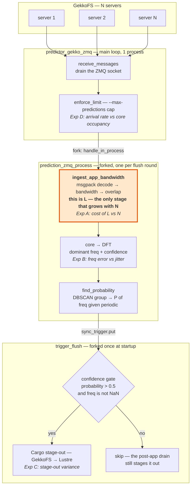
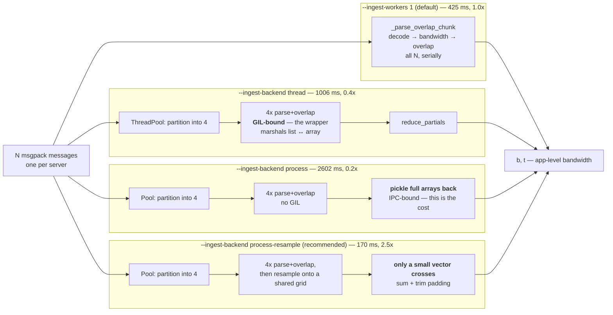

# GLASS / FTIO reviewer-response experiments

Self-contained micro-benchmarks backing the reviewer rebuttal. Everything runs
on **synthetic** GekkoFS messages (no cluster needed) and is covered by
`test/test_jit_experiments.py`. Predictor usage/flags are in `docs/predictor.md`.

- [Reviewer answers (TL;DR)](#reviewer-answers-tldr)
- [The predictor pipeline — and where each experiment probes](#the-predictor-pipeline--and-where-each-experiment-probes)
- [What we learned](#what-we-learned)
- [How the data is generated](#how-the-data-is-generated)
- [Experiment A — ingestion scaling + fan-out backends](#experiment-a--ingestion-scaling--fan-out-backends)
- [Experiment B — misprediction / jitter sensitivity](#experiment-b--misprediction--jitter-sensitivity)
- [Ingest profile — where the time goes](#ingest-profile--where-the-time-goes)
- [Experiment C — stage-out variance](#experiment-c--stage-out-variance)
- [Stress test — faster arrivals](#stress-test--faster-arrivals)
- [Choosing the driver application (large periodic checkpoints)](#choosing-the-driver-application-large-periodic-checkpoints)

## Reviewer answers (TL;DR)

- **R2/R3 "single instance bottlenecks at hundreds of servers":** **it does not.**
  - *Latency:* ingesting one flush round costs `L`, ~linear in the server count
    (0.90 ms/server at 1024 events/msg). The predictor is healthy while `L` < the
    flush interval `T`; past that, predictions go stale rather than crash. **At
    GekkoFS's actual ~5 s flush a single process keeps up with ~5,600 servers**
    (~1,240 even at 4096 events/msg), and a slower interval scales that
    proportionally. Hundreds of servers is not close to the wall.
  - *Speed-up:* the `process-resample` fan-out gives a flat **2.5x** (2.0–2.8x
    across the grid), constant in N — so it defers the wall by ~2.2–2.5x in
    server count, at a cost of 4 cores per prediction. Real, but headroom rather
    than a fix: it only matters in the corner where events/msg *and* server count
    are both large.
  - *Posting rate:* not a constraint. The core-occupancy ceiling is ~30 Hz,
    ~150x above the 0.2 Hz GekkoFS actually posts at.
  - Removing the wall entirely needs the horizontal shard: B(t) is additive, so
    it splits with an **exact** merge (`overlap_two_series`).
- **Robustness:** frequency recovered within ~4% up to 30% jitter, graceful
  after.
- **Stage-out:** the Exp C tool decomposes the real Lustre flush log
  (FTIO-triggered vs post-app, copy vs delete).

## The predictor pipeline — and where each experiment probes

One flush round, end to end. **`L`** (the ingest stage) is the quantity every
scaling argument in this document turns on: it is the only stage that grows with
the server count *N*.



**One message per server per flush round** (9-field msgpack), so a round is *N*
messages. The main loop drains them and forks a prediction; the prediction
ingests, transforms, and scores; a separate long-lived process gates on
confidence and calls Cargo.

Two consequences that the rest of this document leans on:

- **Only `ING` scales with *N*.** The DFT runs on the reduced series, whose
  length is set by the time window, not by the server count. So "does the
  predictor scale" reduces to "does `L` stay under the flush interval".
- **Predictions are concurrent, not queued.** Each round forks its own process,
  so several are in flight at once — which is why Exp D's limit is *core
  occupancy* rather than a serial backlog.

## What we learned

1. **The bottleneck the reviewers asked about is not there.** At GekkoFS's real
   ~5 s flush a single process keeps up with ~5,600 servers (1024 events/msg).
   Measuring the *right* interval mattered more than any optimisation: against a
   hypothetical 1 s flush the system looks strained, against the actual 5 s one
   it has 30–99% headroom in 19 of 20 measured cells.
2. The **additive structure of B(t)** makes fan-out exact and shardable — the
   real scalability story, and the only thing that removes the wall rather than
   deferring it.
3. **Naive parallelism is the wrong instinct:** plain processes are IPC-bound
   (0.2x), threads GIL-bound (0.4x). Proven by profiling, not assumed.
4. **The win was shrinking what crosses the process boundary** (resample to a
   tiny grid), not parallelizing harder → ~2.5x, deferring the wall by ~2.2–2.5x
   in server count.
5. **A speed-up is not free.** 2.3x on 4 workers is 59% parallel efficiency, so
   each prediction costs 1.7x more CPU (688 vs 403 core-ms). Latency down, total
   work up — which is why the fan-out is headroom to switch on when you need it,
   not a default to leave on.
6. Three real parser bugs fixed on the way (silent 8/9-field message drop,
   bandwidth/timestamp misalignment across a batch, `total_bytes` overwrite).
   These also roughly **halved the single-process baseline**, which is why the
   absolute latencies below are ~1.8x lower than the first round of measurements.

## FAQ

**Which backend is fastest, and why?** `process-resample` (~2.5x). Each worker
parses+overlaps its share in its own process (no GIL) and returns a small
resampled vector (no big-array IPC). Plain `process` is IPC-bound (0.2x);
`thread` is GIL-bound (0.4x).

**Why do I need this if the single process is already fast?** At GekkoFS's real
scale, you very likely don't. Ingest cost grows ~linearly in the server count, so
the fan-out only earns its 4 cores once one round stops fitting in the flush
interval — which at a 5 s flush means several thousand servers. Below that it
returns a fresher prediction you had no use for, at 1.7x the CPU.

**Does the JIT launcher use the fan-out?** Yes — `jitsettings.py:125` sets
`ftio_args = "-m write -v --freq 10 --ingest-workers 4"`, so GLASS runs the
process-resample fan-out by default. **Given the numbers above, that default is
arguably wrong**: at GLASS's scale a single process has ample headroom, and the
4 workers cost 1.7x the CPU per prediction to buy latency nobody is waiting on.
Set `--ingest-workers 1` there unless you are actually near the wall.

**Does it work for the generic `predictor` (non-GLASS)?** No, by design. The
fan-out targets the GLASS pattern of hundreds of servers pushing one message
each per round; the generic predictor sees a single aggregated stream, so there
is nothing to fan out. The flags are accepted but unused there.

**Can several predictions run at the same time?** Yes. In the default
(non-debounce) predictor a new prediction *process* is spawned per drained batch
while the loop keeps listening, so predictions run concurrently — up to the core
count. `--debounce` serializes to one at a time. Capping this cleanly is task #7
(bounded pool).

**What happens on a misprediction?** A flush triggers only above a confidence
gate (`probability > 0.5`, non-NaN freq); a missed period still stages out via
the post-app drain. So a misprediction costs an overlap opportunity, not
correctness (details under Experiment B).

**Does resampling lose information?** It replaces the full-resolution step
function with the signal sampled at `-f` Hz — exactly what the DFT consumes, so
the prediction is unchanged (`test_process_resample_recovers_frequency`). Use
`--ingest-backend process` if you need the raw signal.

## How the data is generated

`synthetic_messages.py` builds messages in the **current 9-field GekkoFS wire
format** (verified against `/d/github/JIT/gekkofs/include/common/msgpack_util.hpp`):

```
pack(flush_t, hostname, pid, io_type, start_t[us], end_t[us], req_size,
     total_iops, total_bytes)      # io_type = "w"/"r"
```

- `make_server_message(...)` — one server's message; events form one tight burst
  per period (clean fundamental at 1/period). A `jitter` knob perturbs the burst
  centers (Exp B).
- `make_round(n_servers, ...)` — one flush round, one message per server.

FTIO passes `args.mode[0]` (`"write_sync"` → `"w"`), so ingestion is called with
`io_type="w"`.

## Experiment A — ingestion scaling + fan-out backends

`exp_a_scaling.py` — per-round latency of turning one flush round of *N*
messages into the application-level bandwidth (parse + overlap), the only stage
that scales with *N*. Rerun:
`python -m ftio.api.gekkoFs.jit.experiments.exp_a_scaling --grid --servers 128 512 1024 --events 1024 4096`

Two separate questions, and they need separate answers:

1. **Latency** — what does one round *cost*, in absolute ms? This is what decides
   whether the predictor keeps up, and no ratio can tell you.
2. **Speed-up** — what does the fan-out *buy*, as a ratio? This is what decides
   whether the fan-out is worth its cores.

The wall below is where the two meet.

### What "keeping up" means

GekkoFS posts a flush round every **T** seconds (GLASS: ~5 s). Ingesting one
round costs **L** seconds. If `L < T`, the prediction for round *k* is ready
before round *k+1* lands, and the flush trigger acts on the phase it actually
describes.

If `L > T` it never can be, and nothing crashes — it goes **stale**:

- default (`--max-predictions 0`): predictions overlap, in-flight count grows as
  `L/T`, each holding a core (four with the fan-out). Past the core count they
  timeshare, which inflates `L` further — runaway.
- `--max-predictions N`: `enforce_limit` blocks on the oldest prediction at the
  cap, so the loop stops draining ZMQ and the backlog moves into the socket
  queue. Predictions keep running, on older and older data.
- `--debounce`: strictly serial, so rounds are coalesced — some are simply
  skipped.

In every case the prediction for round *k* arrives after round *k+1* has already
happened, so a stage-out fires for a phase that is over. **`L` vs `T` is the
whole game**; the speed-up only matters insofar as it moves `L`.

### The keep-up wall

Ingest cost grows ~linearly in the server count, so the wall is just
`N_max = T / slope`. **The slope is the directly measured quantity** (at the
largest measured point, 2048 servers):

| ms per server | 1024 ev/msg | 4096 ev/msg |
|---------------|------------:|------------:|
| single        | **0.90**    | **4.03**    |
| process-resample4 | **0.33** | **1.57**   |

**Largest server count that still fits inside the flush interval** (`T / slope`;
`*` = beyond the 2048-server measured range, see the caveat):

| flush `T` | 1024 ev/msg: single | resample4 | 4096 ev/msg: single | resample4 |
|----------:|--------------------:|----------:|--------------------:|----------:|
| 1 s *(faster than GekkoFS ever posts)* | ~1,100 | ~3,000 | ~250 | ~640 |
| **5 s** *(GekkoFS actual)* | **~5,600** \* | ~15,200 \* | **~1,240** | ~3,200 \* |
| 10 s      | ~11,100 \* | ~30,500 \* | ~2,500 \* | ~6,400 \* |
| 15 s      | ~16,700 \* | ~45,700 \* | ~3,700 \* | ~9,600 \* |

**Read the 5–15 s rows — they are the ones that describe reality.** GekkoFS
flushes every ~5 s, and slower (10–15 s) is at least as plausible as faster;
below ~1 s is not an operating point at all. At a 5 s flush a *single process*
already keeps up with **~5,600 servers** at 1024 events/msg, and ~1,240 even at
4096 — and a longer interval scales that proportionally.

So the honest answer to R2/R3 is: **the single instance does not bottleneck at
hundreds of servers. It is fine into the thousands, at every flush interval
GekkoFS actually uses.** The fan-out is not a fix for a problem GLASS has today.
It is headroom for the corner where both knobs are large at once (4096
events/msg *and* a short interval), and it costs 4 cores per prediction.

> **Caveat on the extrapolations (`*`).** The cost is *mildly superlinear*, not
> perfectly linear: the slope drifts up with N (single @1024 ev/msg:
> 0.68 → 0.70 → 0.73 → 0.79 → **0.90** ms/server across 128 → 2048 servers,
> +32%), most likely cache and allocation effects on the growing arrays. The
> table uses the **steepest measured slope** (the 2048-server one) to stay
> conservative, but a starred cell is still an extrapolation past anything we
> measured, and the true wall will be somewhat **closer** than shown. Treat them
> as upper bounds, not predictions. Everything unstarred is inside the measured
> grid.

### Inside `L` — the three backends

`ingest_app_bandwidth` (`ftio_gekko.py`) is where the whole round is spent. What
differs between backends is only **what crosses the process boundary**:



Latencies above are the 512 servers x 1024 events/msg row of the backend matrix
below. Note the fan-out is **exact**: B(t) is an additive sum of per-server box
functions, so any partition folds back to the same series (up to resampling) —
`test_parallel_ingest.py`.

### Latency — the full grid

Absolute cost per round. Best-of-10. `%` = fraction of **GekkoFS's real 5 s
flush** consumed; over 100% (**bold**) cannot keep up. single = 1 process;
thread4/resample4 = 4 workers.

| events/msg | servers | single | thread4 | process-resample4 | speed-up |
|-----------:|--------:|-------:|--------:|------------------:|---------:|
| 1024 | 128  | 87 ms (2%)   | 238 ms   | 31 ms (1%)   | 2.8x |
| 1024 | 256  | 180 ms (4%)  | 494 ms   | 66 ms (1%)   | 2.7x |
| 1024 | 512  | 371 ms (7%)  | 1006 ms  | 186 ms (4%)  | 2.0x |
| 1024 | 1024 | 809 ms (16%) | 2075 ms  | 349 ms (7%)  | 2.3x |
| 1024 | 2048 | 1840 ms (37%)| 3992 ms  | 672 ms (13%) | 2.7x |
| 4096 | 128  | 362 ms (7%)  | 977 ms   | 139 ms (3%)  | 2.6x |
| 4096 | 256  | 725 ms (15%) | 1781 ms  | 314 ms (6%)  | 2.3x |
| 4096 | 512  | 1606 ms (32%)| 3555 ms  | 647 ms (13%) | 2.5x |
| 4096 | 1024 | 3520 ms (70%)| 7933 ms  | 1417 ms (28%)| 2.5x |
| 4096 | 2048 | **8262 ms (165%)** | 15698 ms | 3213 ms (64%) | 2.6x |

**Exactly one cell of twenty misses the 5 s flush** — 2048 servers at 4096
events/msg — and the fan-out rescues precisely that one (165% → 64%). Everything
else has 30–99% headroom on a single process. That is the practical case for the
fan-out, stated without inflation.

(At a 1 s flush the picture would be far tighter — single fails from 2048 servers
at 1024 ev/msg and from 512 at 4096 ev/msg — but GekkoFS does not post that fast,
which is why the 5 s column is the one shown.)

Latency is ~linear in the server count for every backend (mildly superlinear; see
the caveat above), so the wall can be predicted from the slope rather than
discovered in production.

### Speed-up — what the fan-out buys

Same data, read as a ratio (single ÷ process-resample):

| events/msg | 128 | 256 | 512 | 1024 | 2048 |
|-----------:|----:|----:|----:|-----:|-----:|
| 1024       | 2.8x | 2.7x | 2.0x | 2.3x | 2.7x |
| 4096       | 2.6x | 2.3x | 2.5x | 2.5x | 2.6x |

**Flat at 2.0–2.8x (mean 2.5x)** — it does *not* grow with N, because both paths
scale linearly. Two consequences, and they cut in opposite directions:

- *Good:* the ratio is predictable. You can size the wall from a single
  measurement rather than re-benchmarking per deployment.
- *Bad:* a constant factor **defers the wall, it does not remove it**. The
  fan-out changes the slope of the scaling curve, not its shape. Removing the
  wall needs the horizontal shard — B(t) is additive, so `overlap_two_series`
  merges shards exactly.

This is also why the speed-up alone is a misleading headline: 2.5x sounds like
the result, but 2.5x of a latency already past `T` is still past `T`. Read the
latency table first, the ratio second.

### Full backend matrix — {thread, process} × {full, resample}

512 servers, 1024 events/msg, 4 workers, best-of-10:

| backend | latency | vs single | why |
|---------|--------:|----------:|-----|
| single | 425 ms | 1.0x | baseline, one process |
| thread + full | 1006 ms | 0.4x | GIL-bound (parse + overlap wrapper) |
| process + full | 2602 ms | 0.2x | IPC-bound (big arrays pickled out) |
| thread + resample | 714 ms | 0.6x | still GIL-bound; resample only shrinks the reduce |
| **process + resample** | **170 ms** | **2.5x** | no GIL, no big-array IPC — the winner |

**The decisive point: resample only rescues the *process* backend.** Threads'
bottleneck is the GIL on parse+overlap, which resampling doesn't touch (0.4x →
0.6x, still below 1); processes' bottleneck is IPC, which resampling removes
(0.2x → 2.5x). So the winning combination is specifically **process + resample**
— and the two failing backends are kept in the matrix precisely because they are
what you would have reached for first.

**Reading the grid:**
- `single` — one prediction process does the whole parse+overlap; latency scales
  ~linearly with servers × events.
- `thread4` — ~2.5x *slower* (GIL-bound), regardless of resampling.
- `resample4` (= process + resample) — ~2.5x faster. Trade-off: the result is
  the resampled signal, not the full-resolution step function (fine for the DFT;
  frequency preserved, `test_process_resample_recovers_frequency`).

## Experiment B — misprediction / jitter sensitivity

`exp_b_misprediction.py` — 16 servers, period 2 s (gt 0.5 Hz), sweep timing
jitter. Rerun: `python -m ftio.api.gekkoFs.jit.experiments.exp_b_misprediction`

| jitter | detected | rel. error | confidence |
|-------:|---------:|-----------:|-----------:|
| 0.00   | 0.520 Hz | 4.1 %      | 0.80       |
| 0.10   | 0.518 Hz | 3.5 %      | 0.93       |
| 0.30   | 0.510 Hz | 2.0 %      | 0.73       |
| 0.50   | 0.599 Hz | 19.8 %     | 0.72       |

FTIO stays within ~4% up to 30% jitter; only near 50% jitter (burst structure
largely destroyed) does error jump to ~20%, and confidence drops so a
confidence-gated policy discounts it.

### How mispredictions are handled (code, not just this experiment)

Two layers in `stage_data.py` keep a wrong prediction from being harmful:

- **Confidence gating** — a flush is triggered only when
  `latest_prediction["probability"] > 0.5` and the frequency is not `NaN`
  (`stage_data.py:252`). A low-confidence or quiet prediction does not act, and
  Exp B shows confidence drops exactly when the workload gets irregular, so the
  gate discounts noisy predictions automatically.
- **Post-app safety net** — if FTIO *misses* a period (false negative), the data
  still stages out at the end via the `post_app` drain (`triggered_by` in the
  flush log). So a misprediction costs an overlap opportunity, never
  correctness.

Residual risk is a *false positive* above the gate (flushing at the wrong time,
interfering with I/O); minimizing that is what the confidence threshold and the
avoid-interference strategy are for, and Experiment C quantifies it on a real
run.

## Ingest profile — where the time goes

`profile_ingest.py` — stage breakdown at 512 servers: ~22% msgpack decode
(GIL-bound), ~28% numpy bandwidth, ~50% overlap. Even with `nogil=True` on the
numba core, the `overlap()` wrapper does GIL-bound list↔array marshalling, so a
thread pool loses to a single thread — which is why resample (small payload,
separate processes) is the backend that wins.

## Experiment C — stage-out variance

`exp_c_stageout.py` — decomposes the GLASS flush log that
`posix_control._write_flush_log` writes (per item: FTIO-triggered vs post-app,
copy time = Lustre, delete time) into means / std / variance share. Rerun on a
real run's log:
`python -m ftio.api.gekkoFs.jit.experiments.exp_c_stageout <flush_log>`.
Synthetic data only proves the parser — the numbers require a real Lustre run.

## Stress test — GekkoFS posting frequency

`exp_d_stress.py` — how fast can GekkoFS **post** (flush) before one ingester
falls behind? The *posting frequency* is one round per flush = `1 / flush_interval`.
**GLASS currently flushes every ~5 s → 0.2 Hz.** Rerun:
`python -m ftio.api.gekkoFs.jit.experiments.exp_d_stress --servers 512`

**Concurrency model.** Each prediction runs as its own process(es) and several
run at once, so the real limit is **core occupancy**, not a serial queue:
- single-process-per-prediction: 1 core for L₁ s → in-flight cores = `f·L₁`,
  ceiling `C/L₁`.
- resample fan-out: `workers` cores for Lᵣ s → in-flight cores = `f·Lᵣ·workers`,
  ceiling `C/(workers·Lᵣ)`.

Resample gives a **fresher** prediction (lower latency) but uses more cores per
prediction, so single-process sustains a **higher posting frequency** before
pileup.

**Posting-frequency sweep — 512 servers, 1024 events/msg, 16 cores**
(single L₁=403 ms, resample Lᵣ=172 ms; in-flight cores, keep-up):

| posting freq | flush  | single | resample |
|-------------:|-------:|:-------|:---------|
| 0.2 Hz       | 5.0 s  | 0.1 ok | 0.1 ok   |
| 1 Hz         | 1.0 s  | 0.4 ok | 0.7 ok   |
| 5 Hz         | 0.2 s  | 2.0 ok | 3.4 ok   |
| 10 Hz        | 0.1 s  | 4.0 ok | 6.9 ok   |
| 20 Hz        | 0.05 s | 8.1 ok | 13.8 ok  |
| 30 Hz        | 0.03 s | 12.1 ok| **20.6 PILEUP** |

**Max sustainable posting frequency** (before pileup):

| servers | events/msg | single | resample |
|--------:|-----------:|-------:|---------:|
| 512     | 1024       | 39.7 Hz| 23.3 Hz  |
| 4096    | 1024       | 3.7 Hz | 2.4 Hz   |

**Reading it: this ceiling is unreachable, and that is the finding.** GekkoFS
flushes every ~5 s (0.2 Hz) and would never post below ~1 s. The ceiling sits at
**~30 Hz — 150x faster than GekkoFS ever pushes.** At the real operating point
only ~0.1 cores are in flight at 512 servers (~0.9–1.3 even at 4096). Posting
frequency is simply **not a constraint on this system**, and Exp D exists to
establish that, not to inform a choice.

The mechanism, for completeness. Resampling speeds up *each* prediction (2.3x)
but not *everything*, because the speed-up is not free:

| backend | latency | cores held | **CPU per prediction** |
|---------|--------:|-----------:|-----------------------:|
| single | 403 ms | 1 | **403 core-ms** |
| process-resample | 172 ms | 4 | **688 core-ms** |

A 2.3x speed-up on 4 workers is **59% parallel efficiency** — the missing 41% is
partitioning, pool coordination, shipping the resampled vector back, and the
reduce. So a prediction finishes sooner in wall-clock but costs **1.7x more
CPU**: latency down, total work up. That is what sets the two ceilings
(`16 cores / 0.403 s` = 39.7 Hz single vs `16 / 0.688 s` = 23.3 Hz resample), and
it means single-process would in principle sustain a *higher* posting rate than
the fan-out.

**But both numbers are ~100x above anything GekkoFS does, so this never decides
anything.** The only constraint that binds in practice is Exp A's: is `L` under
`T`. Beyond either ceiling predictions pile up unboundedly — which is what the
bounded pool (`--max-predictions`) caps, and why that flag exists.

## Choosing the driver application (large periodic checkpoints)

GLASS needs an app whose I/O has a **clean periodic structure** —
`compute → large checkpoint → compute → …` — so FTIO recovers a single dominant
frequency and triggers a flush per checkpoint. Ranked on workload merit only;
**setup/porting effort is not a criterion** (wiring into `jitsettings.py` is a
few lines). What we score (`★` = fit):

1. **Periodic checkpointing** at a fixed step/time interval → strong single-tone signal.
2. **Real compute phase** between writes (period not dominated by the I/O itself).
3. **Tunable + large checkpoint size** so the GekkoFS→Lustre flush matters.
4. I/O the GekkoFS intercept catches (**POSIX / MPI-IO / pNetCDF / HDF5**).

`★★★` real compute + regular large checkpoint + credible; `★★` good with a
caveat; `★` I/O kernel or emulated compute (controlled use).

**Molecular dynamics** — regular binary restarts, size = #atoms, GekkoFS-friendly POSIX I/O.

| App | Checkpoint & cadence | Fit | Note |
|-----|----------------------|:---:|------|
| **LAMMPS** | binary `restart` every N steps | ★★★ | force a large *binary* restart (default `dump` is small/text) |
| **GROMACS** | `.cpt` + trajectory at fixed interval | ★★★ | `mdrun -cpt N`; robust, huge user base |
| **NAMD** | `.restart` + DCD at `restartfreq` | ★★★ | Charm++ build |
| **AMBER** | `rst7` restart + `mdcrd` | ★★ | AmberTools free, `pmemd` licensed |

**CFD / combustion** — field/plotfile per output interval.

| App | Checkpoint & cadence | Fit | Note |
|-----|----------------------|:---:|------|
| **OpenFOAM** | time-dir write every `writeInterval` | ★★★ | very regular; each write = many files |
| **PeleC / PeleLM** (AMReX) | `plt`/`chk` every N steps | ★★★ | AMReX build |
| **NEK5000 / NekRS** | field `.f0000x` per interval | ★★ | local turbPipe case exists; NekRS is GPU |
| **S3D** | pNetCDF field checkpoint | ★★ | **runs today**; big grid → GekkoFS quota |
| **Nalu-Wind** | restart every N steps | ★★ | Exawind stack |

**Weather / climate / ocean** — history + restart at simulation cadence, size = resolution.

| App | Checkpoint & cadence | Fit | Note |
|-----|----------------------|:---:|------|
| **WRF** | history + restart every N sim-steps | ★★★ | production-credible; WPS + geo/real input |
| **MPAS** (atm/ocean) | netCDF stream at fixed interval | ★★★ | unstructured mesh |
| **E3SM / CESM** | restart + history at cadence | ★★★ | very large checkpoints; heavy build |
| **ICON** | climate restart at interval | ★★ | build/licensing |
| **WACOMM++** | netCDF restart/output | ★★ | niche; ROMS input data |

**Astrophysics / cosmology** — HDF5/AMR checkpoints, the classic checkpoint domain.

| App | Checkpoint & cadence | Fit | Note |
|-----|----------------------|:---:|------|
| **FLASH** | HDF5 `chk` every N steps/time | ★★★ | *the* textbook periodic-checkpoint app |
| **Enzo-E** | HDF5 checkpoint at interval | ★★★ | AMR |
| **GADGET-4 / GIZMO** | snapshot at fixed times | ★★★ | large particle snapshots |
| **Nyx / Castro** (AMReX) | `plt`/`chk` every N steps | ★★★ | AMReX build |
| **HACC** / **HACC-IO** | particle dump | ★★ / ★ | HACC-IO is an I/O kernel (no compute phase) |

**Plasma / fusion & Lattice QCD** — topical, very large regular restarts.

| App | Checkpoint & cadence | Fit | Note |
|-----|----------------------|:---:|------|
| **WarpX** (AMReX) | plotfile/checkpoint every N steps | ★★★ | plasma-PIC, topical |
| **GTC / GTC-P** | restart at fixed steps | ★★ | gyrokinetic fusion |
| **XGC** | checkpoint at interval | ★★ | niche, very large |
| **MILC** (LQCD) | gauge config every N trajectories | ★★ | regular large binary configs |
| **Chroma** (LQCD) | QDP++ config checkpoint | ★★ | build heavy |

**Quantum chemistry / materials.**

| App | Checkpoint & cadence | Fit | Note |
|-----|----------------------|:---:|------|
| **QMCPACK** | HDF5 checkpoint at interval | ★★★ | DOE benchmark, regular |
| **CP2K** | `.restart` per N steps (MD/MC) | ★★ | good periodicity in dynamics runs |
| **Quantum ESPRESSO** | wavefunction restart | ★★ | cadence less regular |
| **VASP** | `WAVECAR` / `CONTCAR` | ★★ | licensed |

**Deep learning / AI — the topical checkpoint story (incl. MLPerf).**

| App | Checkpoint & cadence | Fit | Note |
|-----|----------------------|:---:|------|
| **Megatron-LM / NeMo / DeepSpeed** (LLM) | sharded model+optimizer every N steps | ★★★ | 100s GB–TB checkpoints; *the* current I/O-flush motivation; async-ckpt research; GPU cluster |
| **MLPerf Training** | framework checkpoint per epoch/steps | ★★★ | gold-standard, real GPU compute; needs GPUs + datasets |
| **MLPerf HPC** (CosmoFlow / DeepCAM / OpenCatalyst) | checkpoint per epoch | ★★★ | scientific DL, HPC-credible; GPUs + big data |
| **MLPerf Storage** | DLIO-based: emulated compute + real ckpt I/O | ★★★ (I/O) | purpose-built for storage, **no GPU needed**, has an LLM-checkpoint workload; compute emulated |
| **DLIO** | checkpoint every N steps | ★★ | easy, pure-Python; compute emulated (sleep) |

**Pure I/O benchmarks & checkpoint proxies** — full control, no (or stubbed) compute.

| App | Checkpoint & cadence | Fit | Note |
|-----|----------------------|:---:|------|
| **synthetic checkpoint kernel** | `spin(compute_s); write(ckpt_MB)` loop | ★★ | exact period/size; guaranteed clean signal; controlled figure |
| **MACSio** | multi-app checkpoint I/O proxy | ★★ | purpose-built to emulate real-app checkpoint I/O; compute injectable |
| **h5bench** | HDF5 write patterns | ★ | I/O only |
| **IOR / IO500** | pure write (+ mdtest) | ★ | no compute; control/ranking only |
| **FLASH-IO / VPIC-IO / NAS BT-IO** | checkpoint I/O kernel | ★ | compute stubbed |

**Recommendation (portfolio, not one app).**

- **Headline production app:** **WRF** (weather) or **FLASH** (HDF5 checkpoints) —
  both give the most credible textbook-periodic checkpoint story.
- **Topical AI angle:** **LLM checkpointing** (Megatron/NeMo) is the strongest
  current motivation for ad-hoc-FS + FTIO flushing; if no GPUs, **MLPerf Storage**
  reproduces the checkpoint I/O (incl. its LLM workload) on CPUs.
- **Sweepable workhorse:** **LAMMPS** or **GROMACS** — cheap to vary checkpoint
  size and period for the scaling figures.
- **Controlled figure:** the **synthetic checkpoint kernel** or **MACSio** — exact,
  build/quota-free knobs to isolate FTIO behavior.
- **Fallback that runs today:** **S3D** (with a grid small enough to fit the
  GekkoFS backing store).
